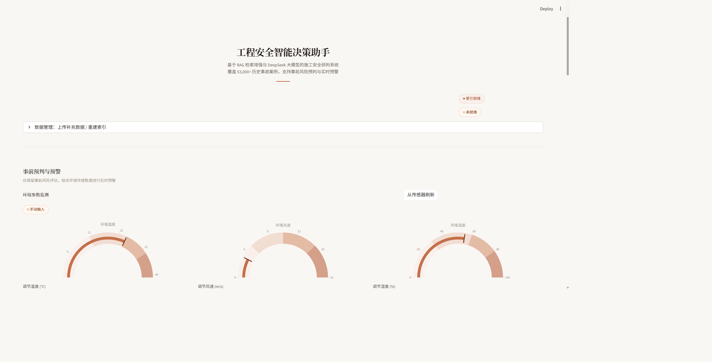
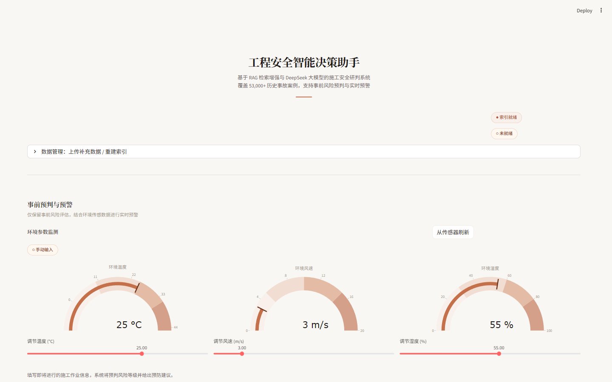

# Construction Safety Assistant

**工程安全智能决策助手** — 基于 RAG + LLM 的施工安全风险分析系统

[](https://www.python.org/)
[](https://streamlit.io/)
[](LICENSE)

---

## 简介

本项目是一个面向建筑工程领域的智能安全分析平台，结合 **检索增强生成（RAG）** 与 **大语言模型（DeepSeek）**，实现：

- 输入施工计划、工种、环境参数，自动输出结构化风险评估
- 基于 5 万+ 历史事故案例的语义检索与相似案例推荐
- 可视化风险仪表盘（温度、风速、湿度、事故趋势）
- 支持 Windows 一键打包安装，无需 Python 环境即可运行

---

## 系统截图

### 主界面总览



### 核心 KPI 指标卡片


### 风险仪表盘（温度/风速/湿度）


### 事故预评估


### RAG 历史案例检索


### 月度事故趋势


### 事故热力图


### 环境因素关联分析



---

## 功能特性

### 事故预评估与风险建议
输入施工计划、工种、环境参数（温度/风速/湿度），系统自动输出：
- 风险等级（1-4 级）
- 潜在危险源
- 管理薄弱点
- 预防措施
- 必备 PPE
- 引用历史案例

### RAG 历史案例检索
- 使用 `sentence-transformers` 生成语义向量
- FAISS 向量索引，支持毫秒级检索
- 语义 + 关键词混合打分（hybrid_score）
- 中英关键词提示扩展（如"高处/坠落/触电"）

### 可视化仪表盘
- 风险仪表（温度、风速、湿度）
- 事故趋势与分布（Plotly）
- 事故画像（工种、危害类型、季节趋势）

### Windows 打包分发
- PyInstaller 一键打包为 Windows 安装器
- 无需 Python 环境，双击即可运行

---

## 快速开始

### 1. 克隆仓库

```bash
git clone https://github.com/<your-username>/Construction-Safety-Assistant.git
cd Construction-Safety-Assistant
```

### 2. 创建虚拟环境

```bash
python -m venv .venv
# Windows PowerShell
.venv\Scripts\Activate.ps1
# Windows CMD
.venv\Scripts\activate.bat
```

### 3. 安装依赖

```bash
pip install -r requirements.txt
```

### 4. 配置 API Key

复制示例配置文件并填入你的 DeepSeek API Key：

```bash
cp settings.example.json settings.json
```

编辑 `settings.json`：

```json
{
  "deepseek": {
    "api_key": "your_api_key_here",
    "base_url": "https://api.deepseek.com/v1",
    "model": "deepseek-chat"
  }
}
```

或使用环境变量：

```bash
# Windows PowerShell
$env:DEEPSEEK_API_KEY="your_api_key"
```

### 5. 启动应用

```bash
# 方式 A：使用项目脚本（推荐）
run_app.bat

# 方式 B：直接运行
streamlit run app.py --server.address 127.0.0.1 --server.port 8501
```

浏览器访问：`http://127.0.0.1:8501`

---

## 项目结构

```text
.
├─ app.py                          # Streamlit 主应用
├─ launcher.py                     # 打包后启动入口
├─ main.py                         # 批量结构化抽取脚本
├─ requirements.txt                # Python 依赖
├─ ConstructionSafetyAssistant.spec # PyInstaller 打包规格
├─ settings.example.json           # 配置模板（不含密钥）
├─ .gitignore                      # Git 忽略规则
│
├─ rag/                            # RAG 检索模块
│  ├─ config.py                    # 数据与索引路径配置
│  ├─ index_builder.py             # FAISS 索引构建
│  ├─ retrieval.py                 # 检索与混合打分
│  ├─ prompting.py                 # 提示词构建
│  ├─ extraction_schema.py         # 结构化输出校验
│  └─ local_pre_assessment.py      # 本地兜底预评估
│
├─ llm/                            # LLM 调用模块
│  └─ client.py                    # DeepSeek 配置解析与调用
│
├─ analysis/                       # 因果分析模块
│  └─ causal_psm.py                # 倾向得分匹配（PSM）
│
├─ sensors/                        # 传感器模块
│  └─ api.py                       # 传感器读取接口（当前 mock）
│
├─ scripts/                        # 工具脚本
│  ├─ start_app.py                 # 开发态启动逻辑
│  ├─ stop_app.ps1                 # 停止服务
│  ├─ build_windows_installer.py   # 一键生成安装器
│  └─ installer_bootstrap.py       # 安装器引导脚本
│
├─ tests/                          # 测试用例
├─ indexes/                        # FAISS 索引与元数据
├─ results/                        # 运行结果
├─ release/                        # 发布产物（安装器）
└─ Injury Severity.CSV             # 事故数据集
```

---

## 数据与索引

### 数据集

默认使用 `Injury Severity.CSV`，包含 5 万+ 条 OSHA 事故记录。

关键字段：
- `abstract`：事故描述文本（用于检索与分析）
- `event_keyword`：事故关键词
- `degree_of_inj_x`：伤害等级
- `date`：事故日期
- `temp`, `wind_speed`, `wind_deg`：环境参数

### 构建索引

```bash
python -m rag.index_builder --device cpu
```

生成文件：
- `indexes/faiss.index`：FAISS 向量索引
- `indexes/metadata.parquet`：元数据

---

## 测试

```bash
pytest -q
```

测试覆盖：
- RAG 引用过滤与约束
- 本地预评估输出结构
- DeepSeek 配置解析
- 启动配置播种逻辑

---

## Windows 打包

### 一键打包安装器

```bash
python scripts/build_windows_installer.py
```

产物：`release/ConstructionSafetyAssistant-Installer.exe`

### 安装后运行

1. 运行安装器
2. 桌面/开始菜单启动应用
3. 浏览器打开 `http://127.0.0.1:8501`

---

## 常见问题

### 启动后浏览器没打开？

手动访问：`http://127.0.0.1:8501`

### 提示缺少索引文件？

```bash
python -m rag.index_builder --device cpu
```

### DeepSeek 报 API Key 缺失？

检查：
- 环境变量 `DEEPSEEK_API_KEY`
- `.env` 文件
- `settings.json` 文件

### 如何查看启动日志？

打包版本日志路径：`%LOCALAPPDATA%\ConstructionSafetyAssistant\launcher.log`

---

## 安全说明

本项目已配置 `.gitignore` 保护敏感文件：

- `settings.json`（含 API Key）不会被提交
- `.env` 文件不会被提交
- `settings.example.json` 提供配置模板（不含密钥）

**请勿将真实 API Key 提交到公开仓库。**

---

## Roadmap

- [ ] 接入真实传感器（MQTT/HTTP/串口）
- [ ] 增加多工种风险模板
- [ ] 引入用户权限与审计日志
- [ ] 支持多项目/多工地数据隔离
- [ ] 增强检索评估指标与可解释性

---

## License

MIT License - 详见 [LICENSE](LICENSE) 文件
