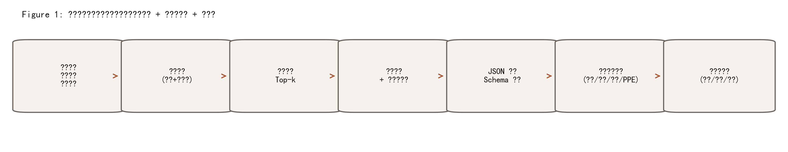
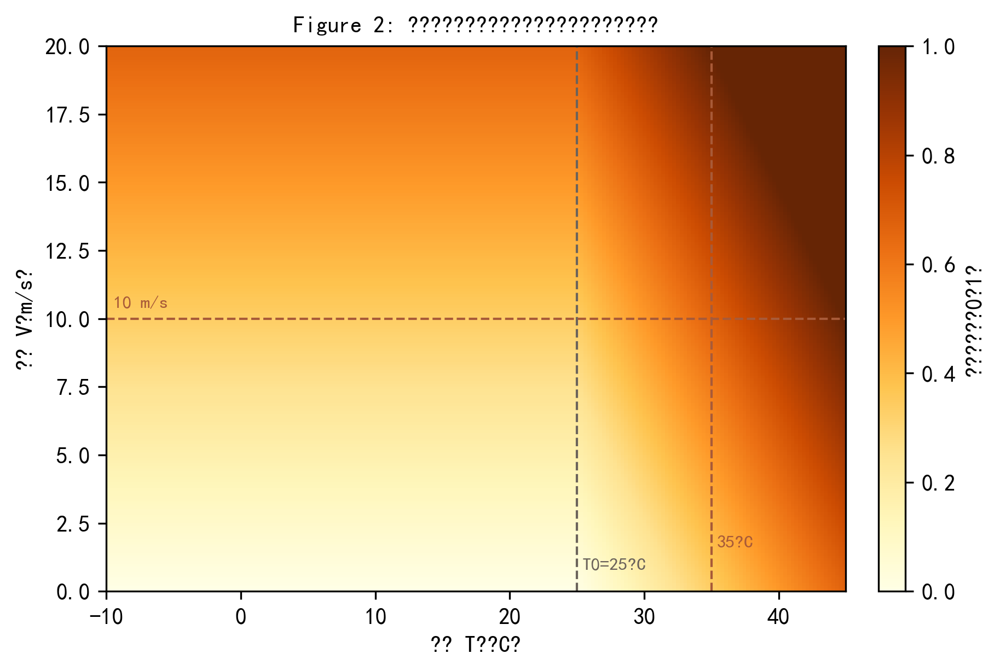

# 基于 AI 智能分析的工程项目精细化运维（安全）管理系统：方法论、关键技术与参数设定（论文式写作示例）

本文给出一个面向工程项目运维与施工安全管理的智能决策系统之方法论叙述，重点回答“系统如何从工程现场的作业计划与环境条件出发，借助历史事故证据与大模型推理，形成可执行、可追溯且可验证的风险评估报告”。写作遵循工程安全研究中常见的论文编排方式：先明确系统应满足的性质，再描述数据与知识库构建、检索增强推理（RAG）与结构化信息抽取、离线兜底与风险量化、最后给出评估协议与复现要点。为便于将内容直接迁移到论文或结题报告，文中插入必要的图表（Figure、Table）与数学公式，并在每个公式后对符号、参数意义与取值依据进行完整解释。

---

## 3 方法（Methodology）

### 3.1 系统目标与问题形式化（Desired System Properties）

工程项目运维与施工安全管理的本质是“在不完备信息与动态扰动下作出可执行的风险控制决策”。传统方法往往依赖人工巡检、静态表格与经验判断，导致信息割裂、响应滞后和管控难以量化；而纯粹依赖大模型生成的方案，又可能受幻觉、不可追溯与输出不稳定影响，难以进入真实管理流程。因此，本文系统的设计目标被明确为四项可检验性质：其一，**证据可追溯（evidence-grounded）**，系统结论必须指向可复查的历史案例证据；其二，**输出结构化（schema-first）**，风险评估必须以字段化结果交付，以便派单、复盘、统计与审计；其三，**低成本与可部署（cost-aware & deployable）**，在普通 CPU 环境下可运行，并能在外部模型不可用时保持业务连续性；其四，**可复现与可评估（reproducible & measurable）**，对关键参数与评估指标给出明确、可复跑的定义。

基于上述性质，系统将“事前风险评估”定义为一个受约束的输入—输出映射问题：输入包含作业计划文本、工种与专项条件、人员经验结构以及环境参数；输出为风险等级、危险源、预防措施与 PPE 的结构化集合，并附带引用证据与解释性理由（Table 2 与 Table 3）。这种形式化的核心意义在于，把“管理建议”从主观叙述转化为可被程序验证与流程消费的对象，从而为后续的工程化部署与学术评估奠定统一接口。

### 3.2 数据与特征构建：从“脏乱差”到“可检索、可建模”（Data Processing Protocol）

系统的知识基础来自大规模历史事故记录（约 5.355 万条），每条记录同时包含非结构化叙述（事故经过）与结构化属性（时间、地点、气象等），这使得系统既可以采用传统表格建模思路，也可以利用大模型对叙述文本的语义理解能力。为了保障索引与推理的稳定性，数据处理采用“最小必要清洗”的工程策略：既避免过度清洗导致关键信息损失，也避免噪声导致检索与抽取不稳定。我们采用如下四步协议（与安全数据集构建论文常见流程一致）：(1) **一致性清理**：剔除关键字段缺失或明显不合法的记录，保证检索文本与必要属性可用；(2) **标签与字段归一**：将严重度等关键字段映射到统一的离散等级空间（1–4），并对类别字段进行标准化命名，降低“同义不同名”造成的统计偏差；(3) **文本轻量预处理**：对叙述文本做空白归一与缺失值处理，避免缺失值字符串进入语义表示；(4) **面向任务的视图构建**：按“检索、抽取、统计评估”需要构建最小字段集合，既控制存储开销，也减少无关字段对推理的干扰。

Table 1 汇总了本系统使用的事故数据基本统计（样本规模、时间跨度、字段数及关键缺失率），为参数设定提供经验依据：例如气象字段缺失约 7%，意味着系统必须能够在缺失条件下运行；严重度存在极端稀有类别（例如最高等级极少），提示评估时需要关注类别不平衡问题。

**Table 1: 历史事故数据概览与关键字段质量（用于知识库与评估）**

| 指标 | 统计量 |
|---|---:|
| 事故记录数 | 53,550 |
| 时间跨度（date） | 2013-01-01 ～ 2023-01-31 |
| 字段数（列） | 24 |
| 叙述文本缺失率 | 0.00% |
| 关键词字段缺失率 | 0.22% |
| 气象字段缺失率（温度/风速/湿度） | 7.08% |
| 温度分布（°C，P5～P95） | -2.26 ～ 32.24 |
| 风速分布（m/s，P5～P95） | 0.0 ～ 8.2 |
| 湿度分布（%，P5～P95） | 23 ～ 94 |

同时，为了让“事前评估”能够落地到实际作业过程，系统将输入信息划分为三类：作业计划与工种专项信息（体现作业方式与风险源）、人员结构信息（体现经验与违章概率）、以及环境与传感信息（体现外部扰动与风险放大器）。Table 2 给出这些输入变量的类型、范围与管理意义，其中范围的设定并非任意，而是综合了施工环境常见取值区间与界面可交互性：例如风速范围设到 0–20 m/s 可以覆盖常见工地风况并保留对强风预警的表达空间；湿度范围为 0–100% 则与物理量定义一致。

**Table 2: 事前风险评估输入变量（类型、范围与工程含义）**

| 变量 | 类型 | 范围/取值 | 工程含义（为何关键） |
|---|---|---|---|
| 作业计划文本 | 文本 | 任意长度 | 承载“作业对象—工艺—设备—场地”信息，是危险源推断的主依据 |
| 工种类型 | 类别 | 若干典型工种 | 抽象固有风险先验（高处/电气/吊装等）并触发不同的控制策略 |
| 作业高度 | 连续 | 0–200 m | 高处作业后果与救援难度随高度非线性上升，必须显式建模 |
| 作业时段 | 类别 | 白天/夜间 | 夜间可见性与疲劳因素提高事故概率，影响防护与监护配置 |
| 新工人占比 | 连续 | 0–100% | 经验结构影响违章与处置效率，是“人因风险”的量化代理 |
| 温度 T | 连续 | -10–45 °C | 高温/低温影响热应激、材料性能与防滑条件，属于外部风险放大器 |
| 风速 V | 连续 | 0–20 m/s | 风载直接影响高处与吊装稳定性，可触发停工或专项管控阈值 |
| 湿度 H | 连续 | 0–100% | 高湿与降雨伴随，提升湿滑与漏电风险并影响绝缘与摩擦条件 |

### 3.3 知识库构建：语义表示、归一化与向量索引（Knowledge Base Construction）

检索增强推理的前提是把历史案例转化为可检索的知识库。系统采用“语义嵌入 + 向量索引”的方式表示案例文本，并将关键词、事件类型与叙述文本拼接为检索输入，使每条记录同时包含“高信息密度标签”（例如关键词）与“上下文细节”（例如叙述经过）。为了保证相似度计算可解释且与索引类型匹配，系统对嵌入向量进行 L2 归一化，使内积相似度等价于余弦相似度。其基本形式如式 (1)。

$$
\tilde{\mathbf{v}}=\frac{\mathbf{v}}{\|\mathbf{v}\|_2+\varepsilon}
\tag{1}
$$

**式 (1) 解释与取值依据：**  
其中，$\mathbf{v}\in\mathbb{R}^d$ 为文本的原始嵌入向量，$\|\mathbf{v}\|_2$ 为二范数，$\varepsilon$ 为极小常数（用于避免零向量除零，通常取 $10^{-12}$ 量级）。归一化后的向量 $\tilde{\mathbf{v}}$ 满足 $\|\tilde{\mathbf{v}}\|_2\approx 1$，因此两向量的内积 $\tilde{\mathbf{v}}_a^\top\tilde{\mathbf{v}}_b$ 可直接解释为余弦相似度。这样做的关键性在于：一方面减少向量模长差异对相似度的干扰，另一方面使相似度落在较稳定区间，便于后续与关键词得分做线性融合（见 3.4）。在工程上，归一化还能降低索引构建与检索的数值不稳定性，提升跨机器复现一致性。

向量索引选择“精确内积检索”的扁平结构（Flat inner product），其优势在于无需训练、行为确定性强、对 5 万级样本仍具可接受延迟，适合作为研究与工程原型的基线实现。在可扩展性方面，当数据规模上升到百万级后，可在保持式 (1) 归一化不变的前提下，引入近似索引（如 IVF/HNSW）以获得更低延迟，但此时必须同步报告近似误差对检索与引用一致性的影响，这是工程安全应用中不可忽略的“速度—可靠性”权衡。

### 3.4 混合检索与跨语言增强：从召回到重排（Hybrid Retrieval and Cross-Lingual Enhancement）

施工安全文本具有术语密集、表达多样与跨语言输入的特点：事故叙述可能主要为英文，而作业计划常以中文描述；同一危险源也可能以不同措辞出现。为降低“语义对齐失败”带来的漏召回风险，系统采用两类互补机制：其一是**跨语言关键词提示**，当查询包含典型中文危险源词（如“高处、坠落、触电、脚手架、吊装”等）时，自动追加可能的英文关键词提示以增强嵌入对齐；其二是**混合重排**，在语义相似度基础上加入关键词重叠得分，以强化对专业名词与关键动作的硬匹配需求。

语义相似度以归一化向量内积给出，如式 (2)。

$$
s_{\text{sem}}(q,i)=\tilde{\mathbf{e}}(q)^\top \tilde{\mathbf{e}}(x_i)
\tag{2}
$$

**式 (2) 解释：**  
其中，$q$ 为用户查询（由作业计划、工种与环境信息拼接），$x_i$ 为第 $i$ 条案例的检索文本，$\tilde{\mathbf{e}}(\cdot)$ 表示经式 (1) 归一化的嵌入函数。$s_{\text{sem}}$ 越大表示语义越相似。该定义与索引结构一致，使检索阶段具有明确的数学含义，并便于对 top-$k$ 召回做复现实验。

关键词重叠得分以集合交并为基础，同时对查询长度进行归一以避免长查询获得不公平优势。其形式可写为式 (3)。

$$
s_{\text{kw}}(q,i)=\min\left(1,\frac{|\,\text{Tok}(q)\cap \text{Tok}(x_i)\,|}{\max\left(1,\min(|\text{Tok}(q)|,10)\right)}\right)
\tag{3}
$$

**式 (3) 解释与关键实现细节：**  
其中，$\text{Tok}(\cdot)$ 表示分词/切分后的 token 集合。对英文文本，token 可由字母数字串抽取并去除常用停用词；对中文文本，可引入字符二元组（bigram）以在无需复杂分词器的情况下获得粗粒度词片段。分母采用 $\min(|\text{Tok}(q)|,10)$ 的截断，是为了避免长查询把分母拉得过大导致得分过低，同时也限制 token 数带来的噪声；再用 $\max(1,\cdot)$ 防止空集合除零。通过这种设计，$s_{\text{kw}}$ 的意义更接近“查询关键信息是否在案例中出现”，而非“全文词面重叠率”，从而更符合工程安全文本中“少量关键名词决定相似性”的特点。该得分被裁剪到 [0,1]，便于与语义得分线性融合。

最终的混合重排得分采用线性融合（式 (4)），并从更大的候选集合中重排后取 top-$k$。

$$
s_{\text{hyb}}(q,i)=\alpha\, s_{\text{sem}}(q,i) + (1-\alpha)\, s_{\text{kw}}(q,i)
\tag{4}
$$

**式 (4) 解释与参数选择理由：**  
其中，$\alpha\in[0,1]$ 为语义与关键词的权重系数。系统采用 $\alpha=0.85$（即语义 0.85、关键词 0.15），其依据是：语义检索负责解决同义表达与上下文相似，关键词得分作为“硬约束补偿项”用于强化专业名词与关键动作的对齐；若关键词权重过高（例如 ≥0.3），检索容易退化为词面匹配并削弱跨语言与语义泛化能力。推荐在 0.75–0.95 区间结合离线检索指标进行校准：当误召回多、证据噪声大时可提高 $\alpha$；当跨语言漏召回明显或术语必须命中时可适度降低 $\alpha$（提高关键词占比）。此外，先取更大候选集再重排是典型的“召回—排序”两阶段策略，用以提升 top-$k$ 的稳定性与可解释性。

为便于论文呈现，Table 3 总结了检索阶段的关键超参数与推荐调整范围，这些参数共同决定“证据是否可靠”以及“推理是否有边界”。

**Table 3: 检索增强（RAG）关键超参数与推荐范围**

| 参数 | 当前设定 | 推荐范围 | 为什么关键（影响链路） |
|---|---:|---:|---|
| top-$k$（证据案例数） | 3 | 3–8 | $k$ 越大，证据覆盖更广但 prompt 更长、噪声更高、成本更大 |
| 候选扩展倍数 | 8× | 4–12× | 先召回再重排，提高稳定性；过大增加延迟 |
| 混合权重 $\alpha$ | 0.85 | 0.75–0.95 | 决定“语义泛化”与“术语硬匹配”的平衡 |
| token 截断上限 | 10 | 8–20 | 过小会漏掉信息，过大引入噪声并稀释重叠比例 |

### 3.5 证据约束的结构化生成：输出契约、引用过滤与解析校验（Evidence-Constrained Structured Generation）

在推理层，系统将大模型定位为“结构化信息抽取器”，而不是开放式文本生成器。其核心做法是以证据案例与作业信息构造受控提示，强制模型仅输出 JSON，并把输出字段固定为风险等级、危险源、措施与 PPE 等可直接进入管理流程的要素（Table 4）。为了避免模型引用无关或虚构案例，系统对输出中的 citations 进行集合过滤：仅允许引用来自检索到的案例集合 $A$（即 top-$k$ 的 case id）。过滤操作可形式化为式 (5)。

$$
C'=\{c\in C \mid c\in A\}
\tag{5}
$$

**式 (5) 解释与其在安全场景中的必要性：**  
其中，$C$ 为模型输出的 citations 列表，$A$ 为检索模块返回的允许引用集合（证据池），$C'$ 为过滤后的引用集合。该操作的关键意义在于把“模型可引用的证据空间”限制在可复查数据之内，从机制上削弱幻觉：即便模型倾向于生成“看似合理”的引用，过滤也会把不在证据池内的引用剔除；若过滤后 $C'$ 为空，则输出判为不合规，需要重试或进入离线兜底。对于工程安全管理，引用过滤是将系统从“会说”提升为“可审计”的关键一环，因为管理者需要知道建议依据哪些历史事件模式而来，并能够复盘其适用边界。

**Table 4: 风险评估报告输出 schema（用于派单与复盘）**

| 字段 | 类型 | 约束 | 管理用途（为何必须结构化） |
|---|---|---|---|
| risk_level | int | 1–4 | 分级响应与资源投入的触发器 |
| potential_hazards | list[str] | 非空为佳 | 危险源清单用于班前交底与现场排查 |
| preventive_measures | list[str] | 可执行表达 | 直接转化为控制措施与检查项 |
| required_ppe | list[str] | 可执行表达 | 与物资发放、穿戴检查绑定 |
| citations | list[int] | $C'\neq \emptyset$ | 证据追溯与审计复核 |
| rationale | str | 中文、可解释 | 解释风险等级与措施选择依据，支撑人机协同 |

在工程实现上，系统将“可解析性”作为硬指标：对模型输出先做 JSON 解析，再做字段类型与范围校验（如 risk_level 必须在 1–4），并对列表字段做类型强制。大模型调用采用较低温度（temperature=0.0）以降低随机性，max_tokens 设为约 800 以覆盖必要字段表达，timeout 设为约 20 秒以平衡交互体验与网络不确定性。这样的参数设定并非经验主义，而是直接服务于“结构化输出合规率”与“端到端时延”的工程目标：温度过高会导致格式漂移与不可复现，max_tokens 过小会导致字段缺失，timeout 过短会导致失败率上升。

为进一步强调系统在不同条件下的能力边界，Table 5 对比了三种推理模式的优势与局限：纯规则、纯大模型与 RAG+结构化约束。该对比可作为论文中“消融分析（ablation）”的写作入口，用于说明每一项设计选择的必要性。

**Table 5: 推理模式对比（面向可靠性与可审计性）**

| 模式 | 证据可追溯 | 输出稳定性 | 运行成本 | 典型风险 |
|---|---|---|---|---|
| 规则基线（离线） | 中（可解释但无案例证据） | 高 | 低 | 覆盖有限、难适配新场景 |
| 纯大模型生成 | 低（易幻觉） | 中-低 | 中-高 | 引用不可控、格式漂移、不可审计 |
| RAG + 结构化约束（本文） | 高（citations 受限） | 中-高 | 中 | 需维护索引；证据池质量决定上限 |

### 3.6 离线兜底与风险量化：规则模型、气象预警与综合风险分（Fallback and Risk Scoring）

工程系统必须考虑外部 API 不可用、网络波动或密钥缺失等现实约束，因此本文系统采用“双通道推理”：在线模式使用 RAG+大模型输出结构化报告；离线模式使用可解释规则模型输出同一 schema 的报告，以保证业务连续性。规则模型以“工种基础风险 + 条件加权”的形式刻画：工种类型提供先验风险基座（如高处、吊装、拆除相对更高），随后依据作业高度、班次、新工人占比与气象条件进行增量修正，并通过上取整与裁剪映射到 1–4 的离散等级。其计算可抽象为式 (6)。

$$
L=\text{clip}_{[1,4]}\left(\left\lceil b(\text{trade})+\Delta_h(h)+\Delta_s(\text{shift})+\Delta_n(p)+\Delta_T(T)+\Delta_V(V)+\Delta_H(H)\right\rceil\right)
\tag{6}
$$

**式 (6) 完整解释（含阈值为何重要）：**  
其中，$L$ 为输出风险等级（1–4），$b(\text{trade})$ 为工种基础风险分，$h$ 为作业高度（m），$\text{shift}$ 为作业时段（白天/夜间），$p$ 为新工人占比（%），$T$ 为温度（°C），$V$ 为风速（m/s），$H$ 为湿度（%）。$\Delta_\*(\cdot)$ 表示对应因素的风险增量函数，$\lceil\cdot\rceil$ 表示上取整，$\text{clip}_{[1,4]}(\cdot)$ 将结果限制在 [1,4]。该结构的关键性在于它把管理经验显式化，并能清晰解释“风险为什么升高”：例如当 $h\ge 5$ m 时 $\Delta_h$ 增加，反映高处作业的后果与暴露时间上升；当 $h\ge 15$ m 时增量更大，反映坠落后果更严重与救援更困难；夜间作业通过 $\Delta_s$ 加权体现可见性与疲劳因素；新工人占比在 25% 与 50% 的分段加权体现经验结构变化对违章概率的影响。气象阈值（如高温、强风、高湿）在工程安全中常作为停工或专项管控触发条件，因此在规则模型中以分段函数实现，既便于解释，也便于与企业制度对齐并做本地校准。

除离线风险等级外，系统还输出可视化的综合风险分（0–100），用于在界面中形成直观的“风险强度”标尺，并与预警阈值联动。综合风险分由风险等级与气象影响共同构成。气象影响映射如式 (7)，并在 Figure 2 中以热力图展示其随温度与风速变化的归一化形态。

$$
\text{TempScore}(T)=\max\left(0,\frac{T-T_0}{\Delta T}\right),\quad
\text{WindScore}(V)=\frac{V}{V_0},\quad
I_{\text{climate}}=\text{clip}_{[0,1]}\left(\frac{\text{TempScore}(T)+\text{WindScore}(V)}{2}\right)
\tag{7}
$$

**式 (7) 解释与参数取值依据：**  
其中，$T_0$ 为温度基线（取 25°C，用于表示相对舒适、风险较低的参考点），$\Delta T$ 为温度归一化尺度（取 15°C，使 25→40°C 的增量覆盖典型高温施工区间），$V_0$ 为风速归一化尺度（取 15 m/s，使风速在常见工地范围内映射到合理区间）。$I_{\text{climate}}\in[0,1]$ 表示气象对风险的放大强度。选择线性映射并进行裁剪，是为了在缺乏精确现场热应激/风载模型时仍获得可解释的单调函数；同时，通过 $T_0$ 与尺度参数可以进行地区化与制度化校准：若处于高温地区或企业高温作业管控更严格，可降低 $T_0$ 或缩小 $\Delta T$ 使高温更早产生显著影响；若吊装作业对风速更敏感，可降低 $V_0$ 以提高风速的贡献。

在此基础上，综合风险分定义如式 (8)。

$$
S_{100}=100\cdot \text{clip}_{[0,1]}\left(w_L\cdot \frac{L-1}{3}+(1-w_L)\cdot I_{\text{climate}}\right)
\tag{8}
$$

**式 (8) 解释与权重设定理由：**  
其中，$S_{100}$ 为 0–100 的综合风险分，$L$ 为离散风险等级（1–4），$w_L$ 为等级权重（取 0.7）。$\frac{L-1}{3}$ 将等级线性归一到 [0,1]。选择 $w_L=0.7$ 的理由是：在一般施工场景中，工种、人员结构与管理状态决定了风险“基座”，气象因素更常作为放大器与触发器；因此让等级贡献占主导可避免在气象轻微波动时综合风险分被过度拉动。若研究场景转向极端天气运维（如抢险抢修），可通过提高气象权重（降低 $w_L$）来反映外部扰动主导的风险结构。综合风险分随后可按阈值映射为低/中/高风险，用于界面标签与管理动作分级。

为体现“预警可操作性”，系统对关键气象条件设置直接预警阈值（Table 6），例如强风条件下建议暂停高处与吊装作业。阈值并不等同于精确的物理临界点，而是“面向管理动作的触发线”：它们应当在后续以现场制度、规范与历史事件统计进行校准，并与工种类型联动实现更细的策略（例如吊装作业的风速阈值通常应更严格）。

**Table 6: 环境预警阈值（面向管理动作的触发线）**

| 条件 | 触发阈值 | 预警含义（为什么用该阈值） |
|---|---:|---|
| 高温 | $T>35$°C | 热应激与中暑风险显著上升，需调整工时与补水、药品与监护 |
| 低温 | $T<0$°C | 结冰与材料脆裂风险上升，需加强防滑与设备检查 |
| 强风 | $V>10$ m/s | 高处与吊装稳定性显著下降，可触发暂停或专项管控 |
| 高湿 | $H>85$% | 湿滑与漏电风险升高，需加强防滑、防漏电与绝缘检查 |

### 3.7 评估协议：结构化合规、检索质量与因果分析模块（Evaluation Protocol）

系统评估需要同时覆盖“检索是否提供可靠证据”“模型输出是否满足契约”“风险量化是否稳定可解释”，以及在工程管理研究中常见的“干预是否有效”。因此本文建议采用三层评估协议：第一层为检索质量，关注 top-$k$ 的相关性、稳定性与跨语言鲁棒性；第二层为结构化输出合规，关注 JSON 解析成功率、字段完整率、范围合法率与引用有效率；第三层为管理研究评估，关注在观测数据下对干预措施的因果效应估计。

对于检索质量，在缺乏人工标注“相关案例”集合时，可以采用两种可行路径：其一是构建小规模人工标注集，报告 Recall@k 与 MRR 等指标；其二是采用弱监督信号（例如严重度、事件关键词一致性）构造 proxy relevance，用于对检索策略做相对比较。结构化输出合规可以定义为一组明确的比率指标，例如：

$$
\text{ValidRate}=\frac{\#\{\text{输出可解析且字段合法}\}}{\#\{\text{总请求}\}},\quad
\text{CitationValidRate}=\frac{\#\{\text{citations 过滤后非空}\}}{\#\{\text{总请求}\}}
\tag{9}
$$

**式 (9) 解释：**  
ValidRate 衡量系统端到端输出是否可被程序消费，是工程上线的底线指标；CitationValidRate 衡量证据链是否成立，是“可审计性”的底线指标。两者共同决定系统是否能进入派单与复盘流程：一旦 CitationValidRate 下降，系统可能仍“看起来合理”，但证据不可追溯将使其难以被组织采纳。

在管理研究评估方面，系统内置轻量倾向得分匹配（PSM）模块，用于示范如何在观测数据中估计某类管理干预（例如投诉驱动检查）对未来事故概率的影响。倾向得分可由逻辑回归估计，如式 (10)。

$$
e(\mathbf{x})=\Pr(T=1\mid \mathbf{x})=\sigma(\beta_0+\boldsymbol{\beta}^\top \mathbf{x}),\quad
\sigma(z)=\frac{1}{1+\exp(-z)}
\tag{10}
$$

**式 (10) 解释与其在工程管理中的意义：**  
其中，$T$ 为干预指示变量（1 表示接受干预，0 表示未接受），$\mathbf{x}$ 为协变量向量（如行业风险、企业规模、历史事故、区域风险、培训水平等），$\beta_0,\boldsymbol{\beta}$ 为模型参数。$e(\mathbf{x})$ 的含义是“在给定协变量条件下接受干预的概率”，它把多维协变量压缩到一维可比尺度，使得后续匹配可以在该尺度上寻找相似个体。其关键性在于：当干预并非随机分配时，直接比较 $T=1$ 与 $T=0$ 的结果会受到选择偏差影响；倾向得分提供一种在观测研究中减少偏差的常用机制。

匹配策略采用 1-最近邻匹配并设置 caliper（匹配差距上限），如式 (11)。

$$
m(i)=\arg\min_{j:T_j=0}\left|e_i-e_j\right|
\quad\text{s.t.}\quad \left|e_i-e_{m(i)}\right|\le \delta
\tag{11}
$$

**式 (11) 解释与参数 $\delta$ 的选择理由：**  
其中，$i$ 为处理组（$T_i=1$）样本索引，$m(i)$ 为其匹配到的对照组索引，$e_i$ 为样本 $i$ 的倾向得分，$\delta$ 为 caliper。caliper 控制“可比性”与“样本量”之间的权衡：$\delta$ 越小，匹配越严格、偏差更小，但可匹配样本变少、方差变大；$\delta$ 越大，样本更多但可比性下降。工程实践中常在 0.05–0.2 区间探索，并结合匹配后协变量平衡性诊断决定最终取值。系统默认取 $\delta=0.08$，属于较保守的匹配约束，偏向提升可比性与结论可信度。

在匹配集合 $M=\{(i,m(i))\}$ 上，处理组平均处理效应（ATT）可写为式 (12)。

$$
\text{ATT}=\frac{1}{|M|}\sum_{(i,m(i))\in M}\left(Y_i-Y_{m(i)}\right)
\tag{12}
$$

**式 (12) 解释：**  
其中，$Y$ 为结果变量（例如未来是否发生事故，0/1）。ATT 衡量“对已接受干预者而言，干预相对不干预带来的平均变化”。在安全管理语境中，若 $Y$ 表示事故发生，则 $\text{ATT}<0$ 可解释为干预与更低事故概率相关联。为了给出不确定性量化，系统使用 bootstrap 重采样得到置信区间（式 (13)）。

$$
\text{CI}_{95\%}=\left[\text{Perc}_{2.5}\left(\{\widehat{\theta}^{(b)}\}_{b=1}^B\right),
\text{Perc}_{97.5}\left(\{\widehat{\theta}^{(b)}\}_{b=1}^B\right)\right]
\tag{13}
$$

**式 (13) 解释与 $B$ 的设定依据：**  
其中，$\widehat{\theta}^{(b)}$ 为第 $b$ 次 bootstrap 的效应估计（如 ATT/ATE），$B$ 为重采样次数。$B$ 越大，区间越稳定但耗时越高；在研究原型与报告撰写中，$B=200$ 通常能在稳定性与成本间取得平衡，快速验收可降至 30–80，正式结果可视算力提高到 500 或更高并报告运行时间。

### 3.8 复现与部署要点（Reproducibility and Deployment Notes）

为了支持跨机器复现与非技术用户试用，系统在工程化层面引入“依赖隔离、索引持久化与启动器封装”。依赖隔离避免污染全局环境并降低协作门槛；索引持久化保证检索在多次运行间保持一致；启动器封装则将交互界面以本地服务形式启动，便于在校园或企业内网环境下落地。配置建议采用环境变量注入密钥与模型参数，以满足安全合规与可移植性（例如将 API Key 与模型地址从代码中剥离）。在可用性方面，系统必须显式定义降级策略：当在线推理不可用时自动进入离线兜底，并保持输出 schema 一致，从而保证派单与统计链路不因推理通道切换而断裂。

---

## 参考文献（写作示例，按需替换为你的论文格式）

[1] Lewis, P. et al. Retrieval-Augmented Generation for Knowledge-Intensive NLP Tasks. 2020.  
[2] Reimers, N., Gurevych, I. Sentence-BERT: Sentence Embeddings using Siamese BERT-Networks. 2019.  
[3] Johnson, J., Douze, M., Jégou, H. Billion-scale similarity search with GPUs. 2019.  
[4] Rosenbaum, P. R., Rubin, D. B. The central role of the propensity score in observational studies for causal effects. 1983.

